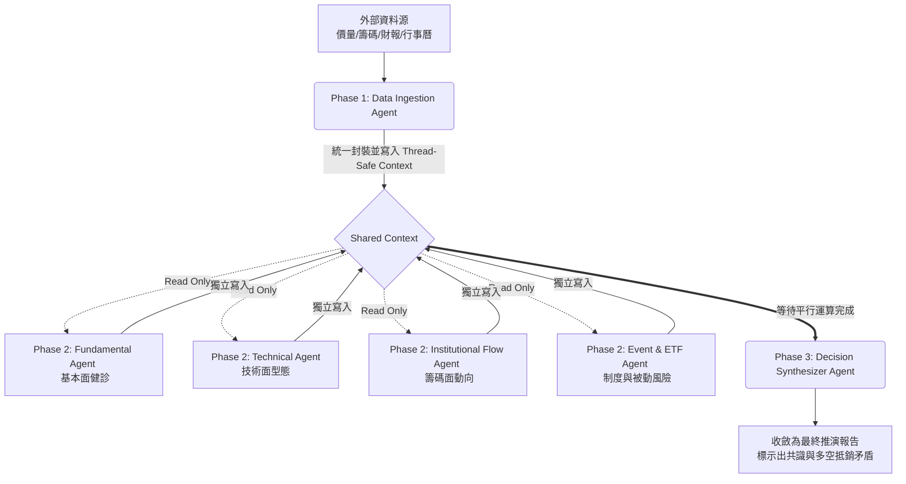

# TWSE Multi-Agent AI (台股多智能體決策架構)


**這是一個專為「台灣股市（TWSE / TPEx）」量身打造的多 Agent 人工智慧投資決策架構 (MVP)。**

傳統的 AI 預測模型多半是以美國股市（高度效率市場）為假設前提開發。然而，台股擁有極其特殊的在地化特徵，例如：淺碟市場易受操控、三大法人籌碼戰、除權息與融券強制回補的制度性換手、以及近年巨型高股息 ETF 帶來的被動式資金「吃豆腐」效應。

本專案跳脫單一模型預測的神話，採用 **「平行盲測運算 (Parallel Blackbox Execution)」** 與 **「多空矛盾推演」**，模擬專業法人機構中不同研究部門的獨立審查機制。

---

## 🌟 核心架構與設計理念

本系統在底層強制規範所有的 Agent 必須是 **Stateless (無操作狀態)** 且 **嚴禁提供主觀預測與交易點位建議**。整個系統分為三個階段流水線 (Pipeline)：



### 1. Phase 1: 數據收集 (Data Ingestion)
將台股散落各處的特有數據（如三大法人買賣超、融資券增減、除權息日、ETF 成分股異動）清洗並封裝成單一 JSON，存入 `SharedContext`。

### 2. Phase 2: 平行盲測分析 (Parallel Blackbox Execution)
利用 Python 原生的 `threading` 平行啟動四位 Base Agent。**這些 Agent 相互隔離，無法看見彼此的報告**，僅能從 Context 讀取自己負責的數據維度。確保「基本面好」的認知不會去污染「籌碼面很糟」的判讀。

### 3. Phase 3: 決策合成 (Decision Synthesis)
收集所有報告，進行邏輯斷詞與矛盾比對。當系統發現「基本面擴張但法人籌碼瘋狂撤出」等相悖情況時，不強做預測，而是如實反映系統落入「多空膠著之盲區」，產出風險推演報告。

---

## 📂 專案目錄結構

採用零依賴 (Zero-Dependency) 的純淨 Python 標準庫架構，極易於追蹤與擴展。

```text
twse_multi_agent/
├── main.py                     # 專案啟動入口，觸發 Pipeline
├── src/
│   ├── core/
│   │   └── context.py          # 核心 SharedContext (Thread-Safe Memory)
│   ├── orchestrator/
│   │   └── pipeline.py         # 流程控制與 Thread 平行調度器
│   └── agents/
│       ├── ingestion.py        # 數據收集 Agent
│       ├── fundamental.py      # 基本面分析 Agent
│       ├── technical.py        # 技術面分析 Agent
│       ├── institutional.py    # 法人籌碼分析 Agent
│       ├── event.py            # 制度風險與 ETF 洗盤 Agent
│       └── synthesizer.py      # 最終決策匯集與衝突判斷 Agent
```

---

## 🚀 快速開始 (Quick Start)

目前的 MVP 版本使用**靜態模擬數據 (Mock Data)** 與**基礎關鍵字萃取**展示架構運作。您可以直接運行 `main.py` 來體驗端到端的完整運算流程。

```bash
# Clone the repository
git clone https://github.com/yourusername/twse_multi_agent.git
cd twse_multi_agent

# Run the pipeline (無須安裝額外套件)
python main.py
```

您將會在終端機看到 Phase 1 到 Phase 3 的啟動過程，以及最終產出的 JSON 格式多空推演報告。

---

## 🚧 未來發展藍圖 (Roadmap)

開源社群的協同開發將是這個架構發光發熱的關鍵。歡迎發起 Pull Request 協助推進以下待辦事項：

- [ ] **Real Data 串接**: 將 `ingestion.py` 內寫死的假數據，改由真實 API (如 [FinMind](https://github.com/FinMind/FinMind), `twstock`, `Shioaji` 等) 動態擷取。
- [ ] **LLM 大語言模型整合**: 將 `synthesizer.py` 內的簡易關鍵字計算法，替換為實際調用 OpenAI GPT-4 / Google Gemini API，實現更具深度的語意推演與邏輯辯證。
- [ ] **擴張 Agent 種類**: 加入如「新聞情緒 Agent (News Sentiment Agent)」、「外資期貨空單避險 Agent」等專攻特定指標的觀察器。
- [ ] **Asynchronous 支援**: 將底層 Threading 基礎升級為 `asyncio` 以應對未來更大規模的併發分析。

---

## ⚠️ 免責聲明 (Disclaimer)

**本系統為技術概念驗證 (PoC) 與軟體架構展示，絕對不構成任何財務、投資或交易建議。**
台股市場具有極高風險與不可預測之政策干預。系統設計者與貢獻者不對任何人因依賴本專案產出之分析結果而造成的資金損失承擔任何法律與賠償責任。使用者請務必獨立思考，盈虧自負。
