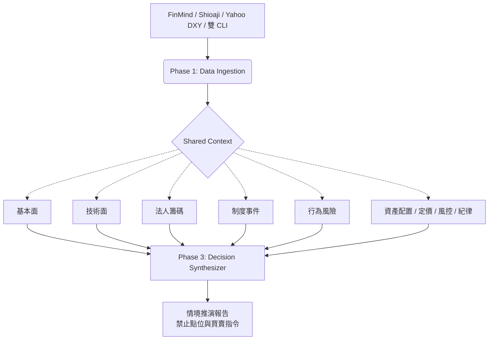

# TWSE Multi-Agent AI（台股多智能體決策架構）


專為台灣股市（TWSE / TPEx）設計的多 Agent **分析**架構（MVP）。用平行盲測與多空矛盾推演，模擬不同研究部門獨立審查，而不是單一模型預測股價。

本系統**不是投資建議，也不會下單**。與券商只做唯讀查詢。

---

## 核心架構

所有 Phase 2 Agent 必須 **Stateless**，彼此看不到對方報告，只能讀 Shared Context 裡自己負責的欄位。


```mermaid
graph TD
    A[FinMind / Shioaji / Yahoo DXY / 雙 CLI] --> B(Phase 1: Data Ingestion)
    B --> C{Shared Context}
    C -.-> D[基本面]
    C -.-> E[技術面]
    C -.-> F[法人籌碼]
    C -.-> G[制度事件]
    C -.-> BR[行為風險]
    C -.-> H[資產配置 / 定價 / 風控 / 紀律]
    D --> S[Phase 3: Decision Synthesizer]
    E --> S
    F --> S
    G --> S
    BR --> S
    H --> S
    S --> R[情境推演報告<br/>禁止點位與買賣指令]
```

### Phase 1 資料收集

資料先寫入 Shared Context，Phase 2 只讀自己那一塊，不再自行打 API。

- **永豐 Shioaji**（唯讀）：日 K 優先、帳戶餘額與庫存。沒金鑰則帳戶標 `not_configured`，價量改走 FinMind；風控預設否決
- **FinMind**：價量備援、三大法人、融資券、月營收、財報 EPS、五年 PE、除權息、停券
- **Yahoo `DX-Y.NYB`**：ICE 美元指數（不是美元兌台幣）
- **Grok Build CLI + Gemini CLI**：近兩週新聞／公告，合併去重後寫入 `open_source_events`，品質一律 `unverified`
- **使用者輸入**：標的、預期漲幅、停損、月線乖離門檻
- **本機**：投資日記、交易冷卻、`config/rules.yaml`

### Phase 2 平行盲測

九個 Agent 同時跑：基本面、技術面、法人籌碼、制度事件、資產配置、定價把關、風控煞車、執行紀律、行為風險（月線乖離／量價背離／假跌破）。

### Phase 3 決策合成

只吃九份報告，不重抓市況。LLM 比對多空矛盾並做情境推演。金鑰後備：SpaceXAI → OpenRouter → Gemini。風控否決會置頂攔截說明。

---

## 各 Agent 資料來源

| Agent | 讀取欄位 | 上游來源 | 產出重點 |
|---|---|---|---|
| 基本面 | `fundamentals`（PE、五年均值／標準差、EPS、月營收） | FinMind PER／財報／月營收 | z-score 估值、15~25 倍、PEG 是否適用 |
| 技術面 | `price_action`（收盤、MA5/20/60、`raw_history`） | Shioaji K 棒或 FinMind 日線 | 均線排列、底部換手、高點防守 |
| 法人籌碼 | `institutional_flow` | FinMind 三大法人、融資券 | 法人同向、資金轉向 |
| 制度事件 | `calendar_events`、`open_source_events`、美元指數 | FinMind 除權息／停券、雙 CLI、Yahoo DXY | 回補／除息、融資 130／140 線、美元 20 日新高、未驗證新聞 |
| 行為風險 | `price_action.raw_history`、月線乖離門檻 | 同上日線 + 使用者輸入 | 月線乖離、高追價、低殺出（非預測） |
| 定價把關 | 收盤／MA20／MA60 + PE | 日線 + FinMind PE | 價位偏高／偏低／合理 |
| 風控煞車 | 帳戶、庫存、漲幅／停損 | Shioaji + 使用者參數 | 風暴比、單一持股是否超過 50% |
| 資產配置 | 現金與庫存 | Shioaji | 現金比、集中度、調節步長 |
| 執行紀律 | `journal_history`、`cooldown_passed` | 本機日記、冷卻計時 | 情緒化傾向、離線散步提醒 |
| 決策合成 | 上述九份報告 | Phase 2 + 人設 yaml | 情境推演；禁止把新聞當事實 |

FinMind 資料集：`TaiwanStockPrice`、`TaiwanStockInstitutionalInvestorsBuySell`、`TaiwanStockMarginPurchaseShortSale`、`TaiwanStockMonthRevenue`、`TaiwanStockFinancialStatements`、`TaiwanStockPER`、`TaiwanStockDividend`、`TaiwanStockMarginShortSaleSuspension`。

`calendar_events` 裡的融資維持率、庫藏股、ETF 觀察名單目前沒有穩定 API，多數為空，Event Agent 會標「資料源待補」。

---

## 目錄

```text
twse_multi_agent/
├── main.py                      # 終端機 Pipeline 入口
├── requirements.txt
├── 開發紀錄.md                   # 決策與里程碑
├── MEMORY_LOG.md                 # 給後續對話的記憶
├── src/
│   ├── core/                    # SharedContext、日記、冷卻、風暴比
│   ├── orchestrator/pipeline.py
│   ├── integrations/
│   │   ├── shioaji_client.py    # 唯讀帳戶／庫存
│   │   └── cli_collectors.py    # Grok / Gemini 合作蒐集
│   ├── analysis/behavior_risk.py
│   ├── agents/                  # Phase 2 / 3 Agent
│   ├── trace/                   # Collector + Mermaid 視覺化
│   └── ui/
│       ├── app.py               # Streamlit 儀表板
│       └── risk_chart.py
└── scratch/                     # 單元／煙霧測試
```

執行期 dump 在根目錄 `trace/task_id=<UUID>/`（不進 Git）。

---

## 快速開始

儲存庫：https://github.com/ergeargwer/twse_multi_agent

```bash
git clone https://github.com/ergeargwer/twse_multi_agent.git
cd twse_multi_agent
python3 -m venv venv
./venv/bin/pip install -r requirements.txt
```

在專案根目錄建立 `.env`（不要提交）：

```bash
# 擇一或並存；Synthesizer 依序嘗試
XAI_API_KEY=
OPENROUTER_API_KEY=
GEMINI_API_KEY=

FINMIND_API_KEY=
SHIOAJI_API_KEY=          # 或 SJ_API_KEY
SHIOAJI_SECRET_KEY=       # 或 SJ_SECRET_KEY

# 雙 CLI 蒐集（預設開啟）
# CLI_COLLECT_ENABLED=0
# CLI_COLLECT_TIMEOUT=180
# CLI_COLLECT_MAX_TURNS=8
```

終端機：

```bash
./venv/bin/python main.py
```

儀表板（建議）：

```bash
PYTHONPATH=. ./venv/bin/streamlit run src/ui/app.py \
  --server.port 8505 --server.address 127.0.0.1
```

本機入口網（Antigravity Portal）一鍵啟動同一組指令，開 [http://127.0.0.1:8505](http://127.0.0.1:8505)。

### Gemini CLI 注意

蒐集端會用 **Node 22** 啟動 Gemini CLI。系統 PATH 若是 Node 18，直接打 `gemini` 會 `Invalid regular expression flags`。可用 `GEMINI_CLI_NODE` / `GEMINI_CLI_BIN` 覆寫。

### 測試

```bash
./venv/bin/python scratch/test_behavior_risk.py
./venv/bin/python scratch/test_cli_collectors.py
./venv/bin/python scratch/test_rule_config.py
```

---

## 藍圖

- [x] FinMind 真實價量／籌碼／財報
- [x] LLM 合成（SpaceXAI / OpenRouter / Gemini 後備）
- [x] Trace 與 Mermaid 流程圖
- [x] Shioaji 唯讀帳戶
- [x] 輔助人格：資產配置、定價把關、風控煞車、執行紀律
- [x] Streamlit 儀表板
- [x] 行為風險（月線乖離／量價背離）
- [x] Grok Build CLI + Gemini CLI 合作蒐集
- [x] 規則與 Prompt 外部化、系統設定唯讀頁
- [x] 方法論校準：PE 標準差位階、集中度 50%、美元指數、融資雙線
- [ ] 新聞情緒獨立 Agent（只讀已蒐集 JSON）
- [ ] 融資維持率／庫藏股／ETF 名單的穩定資料源
- [ ] Threading 升級 asyncio

開發歷程與限制見 [開發紀錄.md](./開發紀錄.md)。

---

## 免責聲明

**本系統為技術概念驗證，不構成任何財務、投資或交易建議。**

台股風險高。設計者與貢獻者不以分析結果承擔損益責任。使用者請獨立思考，盈虧自負。

系統與證券帳戶僅唯讀串接，不具備、也不會實作自動下單。實際交易須由使用者本人在券商官方 App 或網頁完成。
